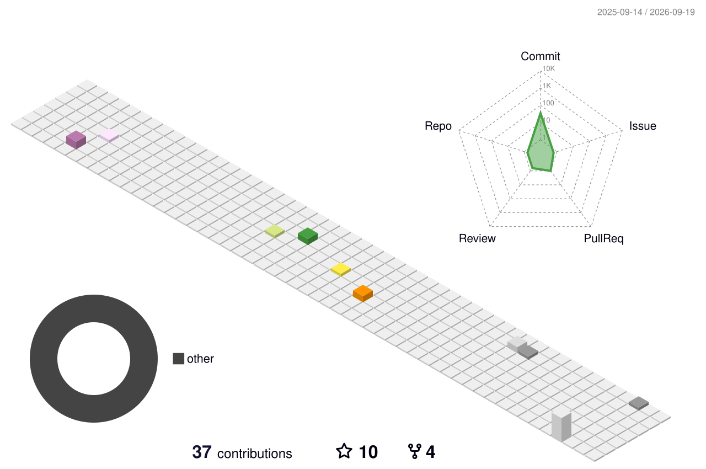

# Hi👋, Welcome to My Github Profile

- 🌱 I’m interested in **Machine Learning and Web Development**

- 👨‍💻 My portfolio website is [here](https://ashutosh-pandey.is-a.dev/)

- 📝 I occasionally write articles on [Medium](https://medium.com/@ashutosh.pandeyhlr007)

- 💬 Ask me about **Python,C++**

- 📫 How to reach me **ashutosh.pandeyhlr007@gmail.com**

|                 💡 My Programming Habits                 |                    🎟️ Follow-up on Issues and PR's                     |
| :------------------------------------------------------: | :--------------------------------------------------------------------: |
|  |  |

## ✒️ Tech Articles

## 🎧🎧 Listening To

## 🔗 Connect with me

 

 
 

 
 

 
 

 
 
 
 

## 🛠️ Languages and Tools

|                   💬 Stackoverflow                   |                    🎩 Notable Contribution                     |
| :--------------------------------------------------: | :------------------------------------------------------------: |
|  |  |

|                  💬 Discussions                  |                   🈷️ Most Used Languages                    |
| :----------------------------------------------: | :---------------------------------------------------------: |
|  |  |

|               🌟 Recent Stars               |                 🎭 Comments Reaction                  |
| :-----------------------------------------: | :---------------------------------------------------: |
|  |  |

|                     🧑‍🤝‍🧑 People                     |                ⏰ Wakatime                 |
| :-----------------------------------------------: | :----------------------------------------: |
|  |  |
