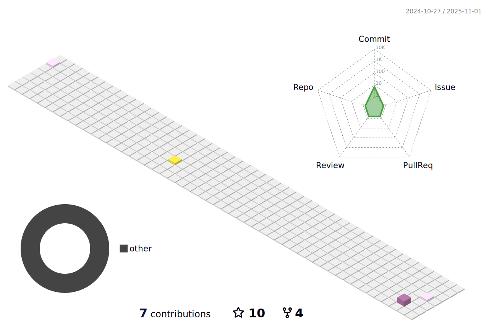

- 🔭 I’m a Former core team member of [GDSC ABESIT](https://gdsc.community.dev/abes-institute-of-technology-ghaziabad/) and I've spoken at some technical [events](https://bit.ly/3EbGR5w) also and would like to give more to the community feel free to reach out.

- 🌱 I’m interested in **Machine Learning and Web Development**

- 👨‍💻 My demo portfolio website is [here](https://datacrusade1999.github.io/)

- 📝 I occasionally write articles on [Medium](https://medium.com/@ashutosh.pandeyhlr007)

- 💬 Ask me about **Python,C++**

- 📫 How to reach me **ashutosh.pandeyhlr007@gmail.com**

- Now Time for a Joke🤣🤣

### 📕📕 Blog posts

<!-- BLOG-POST-LIST:START -->
- [Quantitative Analysis?](https://medium.com/@ashutosh.pandeyhlr007/quantitative-analysis-ba7f3826fa49?source=rss-159a035336bb------2)
<!-- BLOG-POST-LIST:END -->

### 🎧🎧 Listening To

<h3 align="left">Connect with me:</h3>

<h3 align="left">Languages and Tools:</h3>

                

![Metrics](https://metrics.lecoq.io/DataCrusade1999?template=classic&languages=1&stars=1&followup=1&people=1&activity=1&achievements=1&notable=1&discussions=1&base.indepth=false&base.hireable=false&languages.limit=8&languages.threshold=0%25&languages.other=false&languages.colors=github&languages.sections=most-used&languages.indepth=false&languages.analysis.timeout=15&languages.categories=markup%2C%20programming&languages.recent.categories=markup%2C%20programming&languages.recent.load=300&languages.recent.days=14&stars.limit=4&followup.sections=repositories&followup.indepth=false&followup.archived=true&people.limit=24&people.identicons=false&people.identicons.hide=false&people.size=28&people.types=followers%2C%20following&people.shuffle=false&activity.limit=5&activity.load=300&activity.days=14&activity.visibility=all&activity.timestamps=false&activity.filter=all&achievements.threshold=C&achievements.secrets=true&achievements.display=compact&achievements.limit=0&notable.from=organization&notable.repositories=false&notable.indepth=false&notable.types=commit&discussions.categories=true&discussions.categories.limit=0&config.timezone=Asia%2FCalcutta)

